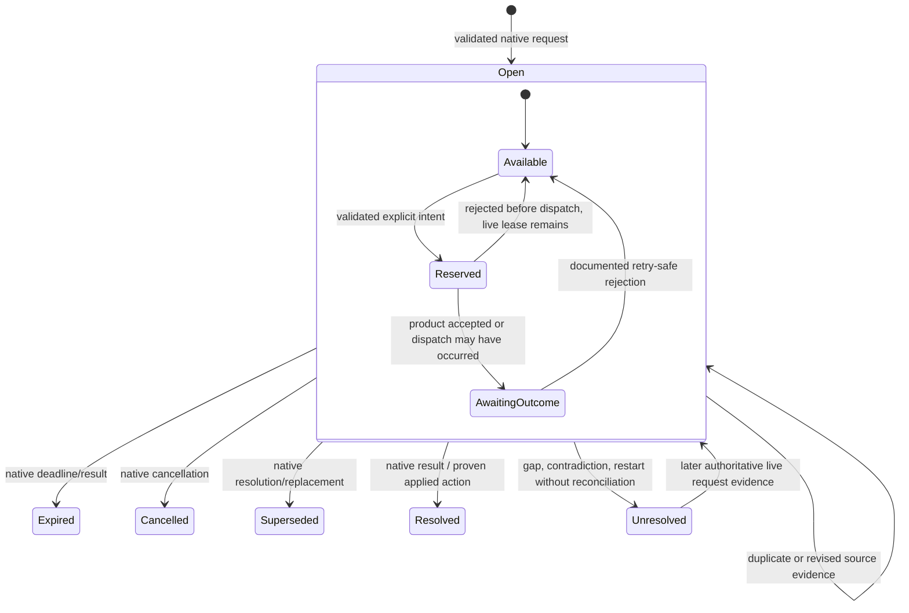

# Attention Request and action-routing semantics

**Decision date:** 2026-07-18  
**Scope:** durable Attention Requests and every person-initiated Agent Product
action. This specifies the request and routing state machines; canonical event
facts, Agent Session lifecycle, Host navigation, and durable-retention periods
remain their respective decisions.

## Decision

An **Attention Request** is a durable, source-attributed record of one
Agent-Product decision or response need. It is not its response channel. A
separate, short-lived **Action Lease** proves that precisely one typed response
may currently be routed to that request (or one explicitly targeted control
action). The lease binds the action to the owning Product namespace, Agent
Session, native Turn/item/request identities where supplied, integration
instance and mode, negotiated Capability, allowed response shape, current
native-state fingerprint, deadline, and one-use nonce.

The core retains the request, drafts, presentation acknowledgement, and
redacted attempt evidence durably. It never retains a response authority past
its native lifetime, reconnection boundary, capability change, action-gate
closure, or Agent Island restart. All state is a tuple rather than an
overloaded status: source request truth, routing availability, local
presentation, and Action Attempt outcome change independently. Thus a person
can dismiss a sheet without resolving Product work, and a Product can resolve
a request elsewhere without making a local response successful.

## Domain model and ownership

An Attention Request is created only from validated `attentionObserved`
evidence. Its authoritative identity is the Agent Product namespace plus its
native request identity. When a Product exposes no reusable request ID, the
Adapter creates an Adapter-scoped key from the exact live callback identity
and a fresh nonce; it is explicitly non-recoverable and never matched by text,
tool name, command, timestamp, title, path, Host Context, or a later request.

Every request records this immutable ownership tuple:

| Field | Rule |
| --- | --- |
| Product and request identity | Authoritative request key; native identity wins over any local correlation ID. |
| Agent Session | Required and must resolve in the same Product namespace. |
| Turn and item/tool/plan identity | Required when supplied; absence means session-scoped, never guessed. |
| Integration provenance | Integration Installation, mode, negotiation snapshot, source event identity, and observation time. |
| Semantic variant | Permission, structured question, plan review, cancellation confirmation, or Product-namespaced extension. It defines the response schema. |
| Source constraints | Native deadline, choices, cardinality, permission suggestions, policy/mode limits, and source state/fingerprint. |
| Content and classification | Context and drafts are Interaction Content; identifiers, state transitions, and redacted result codes are Operational Metadata. |

The same native request evidence is idempotent. A later source revision may
correct its fields only when the Product declares the revision relation. Two
open requests with different native identities remain distinct even when their
text is identical. An event with an absent, invalid, or cross-session owner is
quarantined and cannot create an Attention Request, queue entry, draft, or
action route.

**Action Attempt** is a durable local record of one explicit intent to send
one typed Agent Product action. It has a locally unique attempt ID and refers
to exactly one immutable ownership tuple and one lease version. It records no
secret, raw token, full response content, or reusable native authority.

**Action Lease** is volatile, authenticated response authority supplied by a
live Product surface. It is single-use and cannot be recovered, copied between
requests, or refreshed by local activity. It is not a user-visible permission
grant and must not be confused with a Product permission mode.

## Orthogonal request state

The projection maintains four independent dimensions. Only a source event or
documented synchronous Product result changes `source`; only the local person
changes `presentation`; and no local state alone can turn `routing` into
available.

| Dimension | Values | Authority and rule |
| --- | --- | --- |
| `source` | `open`, `resolved`, `expired`, `cancelled`, `superseded`, `unresolved` | Derived from native request events/results. `unresolved` follows a continuity gap or contradiction and is never silently treated as open. |
| `routing` | `available`, `reserved`, `awaitingOutcome`, `unavailable`, `stale`, `indeterminate` | A live lease plus all validation gates makes it available. Reserving it atomically prevents a duplicate attempt; Product acceptance waits for evidence in `awaitingOutcome`. Restart, reconnect, deadline, source resolution, Capability change, or gate closure revokes it. |
| `presentation` | `queued`, `focused`, `collapsed`, `locallyAcknowledged` | Local-only. `collapsed` and `locallyAcknowledged` do not alter source state or routing. |
| `draft` | `none`, `inProgress`, `valid`, `submitted`, `discarded` | Interaction Content retained locally under the retention decision. A submitted draft is immutable evidence for the attempt; it is not proof of dispatch. |

Only `source=open` and `routing=available` make **Act here** possible. An
open request with unavailable routing remains actionable in its owning Agent
Product and presents **Continue in Host** / Jump Back when navigation is
separately available. A stale, expired, cancelled, superseded, or unresolved
request immediately loses every response control.

### Request and attempt transitions

The diagram describes source and routing only. Presentation may move between
queued, focused, collapsed, and locally acknowledged at any time; it never
takes a source transition. `Resolved` includes a request resolved in the
native Product surface. It is shown as **Resolved elsewhere** unless a
correlated Action Attempt has Product evidence that it caused the result.

## Queueing and presentation

The active queue contains only `source=open` requests, including those whose
routing is unavailable, so the person never loses visibility of native work
that still needs a response. It orders items by immutable priority class then
first source-observed time, with stable native/request-key tie breaking:

1. requests with a known imminent native expiry;
2. consequential choices (persistent permission/profile change, cancellation,
   destructive or irreversible Product action) requiring explicit review;
3. session-only permission approval or denial;
4. blocking structured questions and plan review; then
5. non-blocking source requests.

Expiry proximity elevates an item inside its class without changing the
stable order of items with the same urgency. A higher-priority arrival updates
the compact indicator but does not steal keyboard focus, replace an actively
drafted item, or discard a draft. Queue selection is presentation only. It
cannot reserve a lease or authorize dispatch.

`Collapse`, Escape, quiet-scene suppression, timeout of a completion recap,
and **Acknowledge** for a completion/failure/warning affect presentation only.
There is no generic **Dismiss request** command. That label is allowed solely
when the owning Agent Product exposes a request-scoped dismissal/cancellation
action and the person confirms its stated effect. A local history deletion is
not an Agent Product action and follows the retention decision.

## Validation, authorization, and dispatch

Every route is typed: permission allow/deny or an exact Product-provided
persistent suggestion; a complete structured answer map; plan accept or
reject-with-reason; documented Turn interruption; or a Product-namespaced
action. There is no raw command, terminal key injection, generic `execute`,
or reply-by-text fallback.

Before an Action Attempt reserves a lease, the core and Adapter independently
validate all of the following against their own trusted state:

1. the product namespace, native request, Agent Session, and supplied
   Turn/item identities form the same immutable ownership tuple;
2. the Attention Request is still `source=open`, is current rather than a
   historical/rewound item, and is not source-resolved elsewhere;
3. the integration instance/mode and negotiation snapshot are still compatible,
   and the exact action Capability is available at request scope;
4. the request variant, answer IDs, choice cardinality, content bound, native
   state/fingerprint, Product permission policy/mode, and deadline permit this
   exact semantic choice;
5. the authenticated Action Lease belongs to that request, is unexpired,
   single-use, and has not been revoked by a restart, reconnect, transport
   boundary, source update, action gate, or safety circuit breaker; and
6. the action came from a deliberate local user gesture or a scoped shortcut
   whose confirmation policy has been met.

Failure at any check creates a `rejected` Action Attempt with a redacted
reason and leaves the Product untouched. The controls return to Review only
if the same live lease can still be safely used; otherwise they retire and
offer Jump Back. A validation failure is never transformed into a nearby
request's response.

Reservation atomically changes `routing` from `available` to `reserved`,
binds the immutable submitted payload to one Action Attempt, and disables
equivalent controls locally. The Adapter then attempts exactly one native
dispatch. On failure after reservation it records one of these outcomes:

| Outcome | Meaning and next state |
| --- | --- |
| `rejected` | No native dispatch occurred. Release only if all live validation remains true; otherwise stale the route. |
| `acceptedByProduct` | Product accepted the native response. Await a documented synchronous result or later source evidence; do not call it applied yet. |
| `applied` | A documented result or correlated source event proves the requested effect. Source becomes `resolved` where the Product says the request resolved. |
| `superseded` | The Product/native Host resolved or replaced it first. Revoke sibling routes and show Resolved elsewhere. |
| `indeterminate` | Dispatch may have occurred, but the outcome is unprovable. Route is terminally unavailable for that request; do not retry. |

The acknowledgement shown in the Guided sheet names the exact level: locally
submitted, rejected-before-dispatch, Product accepted, Product applied, or
unconfirmed/indeterminate. A local acknowledgement never implies Product
acknowledgement. Later source evidence may prove an indeterminate attempt's
effect, but it never makes a second dispatch permissible.

## Retry, expiration, and recovery

Agent Island never retries a response automatically. A person may retry only
when the Product documents idempotency for the same native request, the route
remains live, the exact response is still allowed, and the first attempt is
proved rejected before dispatch or explicitly retryable by the Product. The
retry is a new Action Attempt using a new lease; it cannot replay the old
native token. Timeouts, network/IPC ambiguity, helper crashes, and disconnected
callbacks are `indeterminate` unless a documented Product result proves no
dispatch.

Native expiry wins over local clocks. A local deadline is an early warning and
a dispatch guard, not proof that the Product expired. At deadline, source
resolution, Product policy/mode change, Adapter re-negotiation, action-gate
closure, or observed native UI resolution, atomically revoke every lease and
mark unstarted attempts stale. A request that disappears from a
non-exhaustive read becomes `unresolved`, not expired or resolved.

On Agent Island restart, Mac sleep, Adapter reconnect, or changed Product
interface, all leases expire. The durable request and unsent draft remain,
but routing is `stale`/`unavailable` until a documented live native request
with the same authoritative owner tuple supplies fresh response authority.
Reconciliation may establish source state only through its documented scope;
it may never recreate a callback, acceptance token, or synchronous lease.

## Permissions, cancellation, and shortcuts

Permission responses use the narrowest source-offered action. **Allow once**,
**deny/reject once**, and a persistent permission suggestion are distinct
typed actions. A persistent mode/rule/directory/profile is visible only when
the Product supplied that exact scope and the Capability permits it. It always
requires a second, explicit confirmation that repeats scope and persistence.
Agent Island never enables bypass/auto-approval, cycles a permission mode,
widens a source offer, overrides a deny/ask/managed policy, or treats an
existing Product mode as a local grant.

Cancellation and Turn interruption are distinct from responding to an
Attention Request. They target a live named Agent Session/Turn through a
separately negotiated capability and require confirmation unless the Product
documents the action as harmless. Product acceptance of interruption is not
completion; only lifecycle evidence changes execution state. A cancellation
shortcut is therefore a typed Action Attempt with the same ownership,
capability, lease, acknowledgement, and no-guessing rules.

Shortcuts may focus a queue item, open details, or Jump Back without action
authority. Any shortcut that can allow persistent permission, deny work,
cancel/interrupt a Turn, submit content, or cause a destructive action requires
confirmation and revalidates at activation. Holding a shortcut, accessibility
repeat, or a delayed key event cannot repeat an Action Attempt.

## Product-mode routing matrix

| Integration mode | Request / action authority | Mandatory behavior |
| --- | --- | --- |
| Claude Code documented hooks | Only during a live synchronous `PermissionRequest` or applicable `PreToolUse` callback, bound to its exact callback input and offered suggestion. | A timeout, helper loss, or mismatch returns native control; no later response or terminal injection. Free-text revision, arbitrary prompt, and cancellation route to Host. |
| Codex CLI hooks / independent terminal | Observe attention only. | Queue/notify and Jump Back; no native response lease exists. |
| Codex app-server | Outstanding approval request JSON-RPC identity plus native Thread/Turn/item/approval identities; schema-gated user-input and documented Turn controls. | Directly answer only while connected and capability-valid. Disconnect invalidates every route; plan comments are Turn input, not plan approval. |
| Cursor IDE Hooks | Observe only. | Never claim a Hook policy return is an external approval/question/plan channel; Jump Back. |
| Cursor ACP controlled session | Blocking source request/tool-call identity for permission, structured question, plan, or cancellation in an Island-started session. | Respond only to that callback and allowed schema. EOF/error invalidates route and never completes the session. |

## Required conformance scenarios

Fixtures and live acceptance review must prove all of the following:

- duplicate, reordered, and text-identical native requests do not merge;
- one Agent Session's Turn/item/request/lease can never answer another's;
- an observation-only request cannot show an in-Island response action;
- an expired, rewound, resolved-elsewhere, reconnecting, killed, mismatched,
  or post-restart route cannot dispatch or retry;
- a persistent permission suggestion needs explicit second confirmation and
  cannot widen policy/mode; allow-once and deny remain distinct;
- source acceptance, confirmed application, native resolution elsewhere, and
  indeterminate delivery yield visibly different acknowledgements;
- retry works only with a documented live idempotency path and no automatic
  duplicate dispatch occurs under double click, shortcut repeat, crash, or
  timeout;
- collapse, local acknowledgement, queue reordering, sound suppression, and
  switching focused requests do not resolve, discard, or reroute Product work;
- cancellation is scoped to the named current Turn and does not claim
  completion until lifecycle evidence arrives; and
- VoiceOver, keyboard-only, reduced-motion, and high-contrast paths expose
  ownership, consequence, state, confirmation, and Host fallback accurately.
